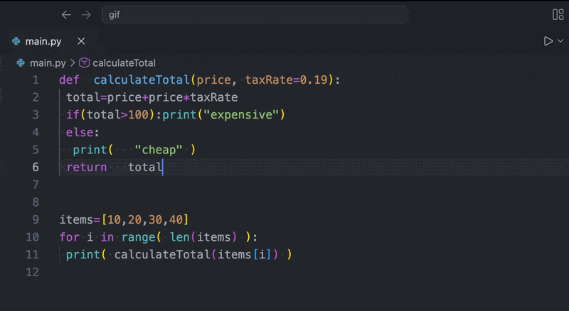

# 42 Python Formatter

Built for 42 students. Format your Python code instantly to match flake8 standards used in the new curriculum.

## Features

- One-click format with `Format Document` or `Shift + Alt + F`
- Flake8-compliant formatting for the new 42 curriculum



## Requirements

> Installing `autopep8` is required for this extension to work.

In your Python environment:

```bash
pip3 install autopep8
pip3 install --user autopep8  # If you don't have root privileges
```

### You might see:

`error: externally-managed-environment`

In that case, install with:

```bash
pip3 install --break-system-packages autopep8
```

Or install it system-wide with Homebrew on macOS:

```bash
brew install autopep8  # System-wide install with Homebrew
```


## Quick Start

Set this extension as the default formatter for Python:

```json
{
  "[python]": {
    "editor.defaultFormatter": "danyarwx.42-python-format"
  },
  "editor.formatOnSave": true
}
```

Then format the current file with:

- macOS: `Shift+Option+F`
- Windows/Linux: `Shift+Alt+F`

You can also use `Cmd+Shift+P` / `Ctrl+Shift+P` and run `Format Document`.

## Settings

### `42-python-format.executable`

Path or command name for the formatter executable. Default: `autopep8`.

### `42-python-format.args`

Arguments passed to the formatter. Default: `["-"]`.

## Notes About Flake8 Compliance

`autopep8` fixes many issues that flake8 reports when they are formatting-related, especially pycodestyle errors. It will not replace flake8 itself, and it will not automatically satisfy every non-formatting plugin rule.

For best results, keep your flake8 configuration in `setup.cfg`, `tox.ini`, `.flake8`, or `pyproject.toml` and run the formatter from the project workspace.
